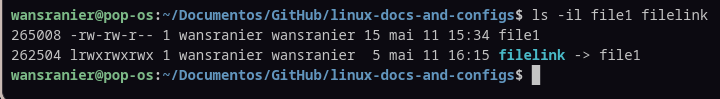

**Vamos criar arquivos e Soft Links com vi e o ln -s**

Nesse guia vou mostrar como criar arquivos com o editor de texto `vi` e criar um 'Symbolic Link' para eles. O 'Symbolic Link' é um tipo de arquivo especial que aponta para outro arquivo ou diretório, permitindo acessar o conteúdo do arquivo original através do link.

O `vi` é um editor de texto poderoso e orientado para tela. Ele tem dois modos principais: modo de comando e modo de inserção. Você começa no modo de comando, onde o que digitamos são interpretados como comandos. Para digitar texto, você deve entrar no modo de inserção.

## Criando um arquivo com `vi`
1. Abra o terminal e navegue até o diretório onde deseja criar o arquivo.

2. Use o comando `vi` seguido do nome do arquivo para criar um novo arquivo. Por exemplo, vamos criar um arquivo chamado 'file1':
```bash
   vi file1
```
3. Dentro do ´vi´, você estará no modo de comando. Para entrar no modo de inserção e começar a digitar, pressione a tecla `i`, agora aparece o nome "--Inserção--" ou "--INSERT--" abaixo onde aparecem os comandos. Agora você pode digitar o conteúdo do arquivo. Por exemplo, digite "Hello, World!".


4. Para salvar e sair do arquivo, você vai pressionar a tecla `Esc` para voltar ao modo de comando, e depois segure a tecla `shift` enquanto clica duas vezes na letra `Z` (ZZ). Isso salva o arquivo e fecha o editor. Confira se o arquivo foi criado:
```bash
ls -l file1
```

5. Agora podemos criar um symlink. O comando é `ln -s <arquivo_origem> <link_destino>`. Por exemplo, para criar um link simbólico chamado 'filelink' que aponta para 'file1', use o seguinte comando:
```bash
ln -s file1 filelink
```
5.1. Precisamos testar os resultados. Use o comando `ls -il`. A opção `-l` serve para mostrar detalhes do arquivo, como as permissões. A opção -i mostra o número do inode, que é um identificador único para um arquivo ou diretório (como se fosse um cpf dele) no sistema de arquivos. O número do inode é importante porque ele é usado pelo sistema de arquivos para gerenciar os arquivos e diretórios. Ele é diferente para cada arquivo ou diretório, mesmo que eles tenham o mesmo nome. Execute:
```bash
ls -il file1 filelink
```
Em seguida, aparecerá algo como:


Podemos observar na linha do `file1`, ele tem o primeiro caractere das permissões é -, indicando um arquivo regular (ex: -rw-r--r--). Já o `filelink` tem o primeiro caractere das permissões é l, indicando que é um link simbólico (ex: lrwxrwxrwx). Os números do inode para `file1` e `filelink` são diferentes, confirmando que eles são arquivos distintos. O `filelink` aponta para `file1`(No final da coluna `filelink -> file1`), mas tem seu próprio número de inode, o que é característico dos links simbólicos.

6. Para verificar o conteúdo do link simbólico, você pode usar o comando `cat` seguido do nome do link. Por exemplo:
```bash
cat filelink
#saída: Hello, World!
```

